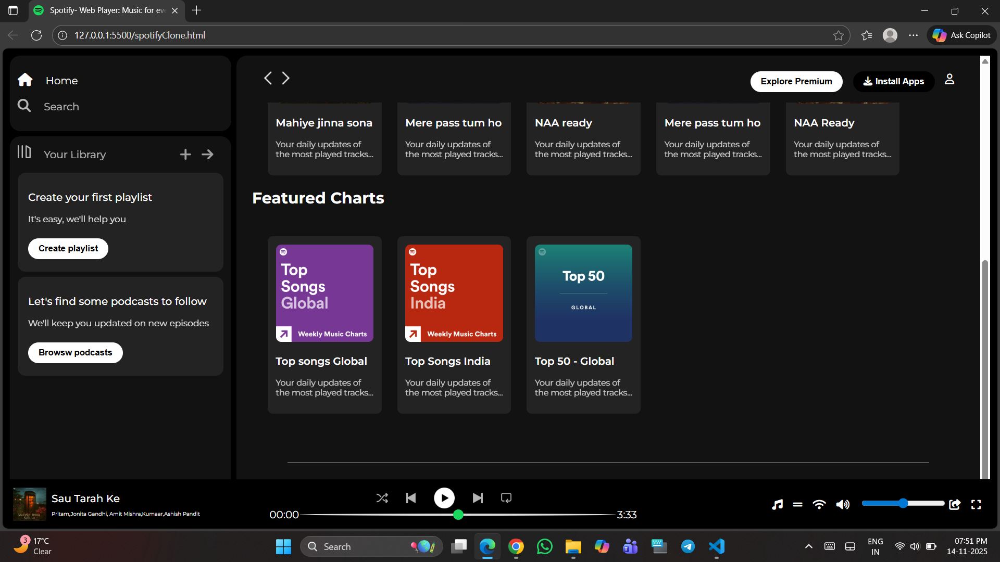

**🎵 Spotify Homepage Clone**
A simple and clean Spotify Homepage Clone built using pure HTML and CSS, focusing on layout, design accuracy, responsiveness, and UI aesthetics. This project is created as a front-end practice exercise to strengthen core web development skills.

**🎯 Features**
🎵 Homepage UI inspired by Spotify
🎨 Fully custom CSS styling
📱 Responsive layout (adapts to different screen sizes)
🖼️ Use of high-quality images and album artwork
📌 Pixel-perfect design approach
⚡ No JavaScript — purely front-end structure

**🛠️ Tech Stack**-
HTML5
CSS3
Google Fonts / Font Awesome
Images & Assets from Spotify UI

**📂 Project Structure**
spotify-clone/
│── index.html
│── style.css
│── album1.jpg
│── album2.jpg
│── logo.png
│── ...

**## 📸 Project Preview**
### 👉 Homepage (Top View)

### 👉 Homepage (Bottom Scrolled View)

**📖 What I Learned**
Structuring clean & reusable HTML
Creating attractive layouts using Flexbox / Grid
Managing project assets (images, fonts)
Improving CSS styling & UI design sense
Understanding web page alignment, spacing, and consistency

